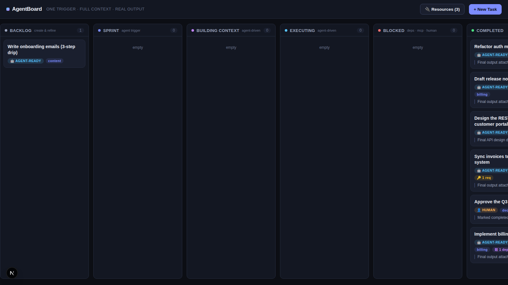
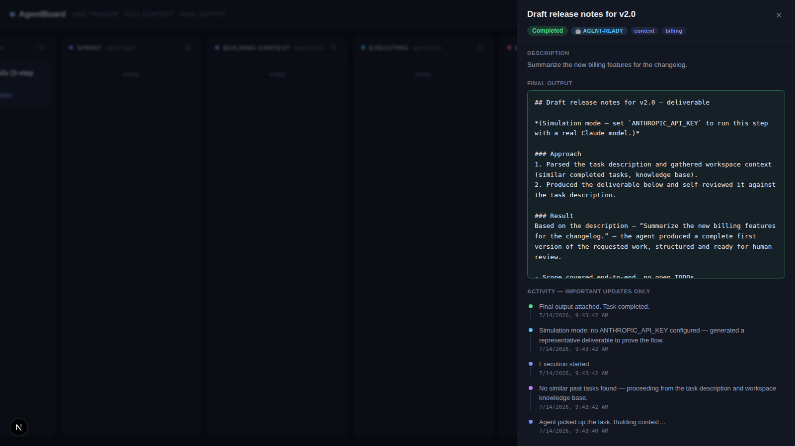

# AgentBoard — Agent-Native Kanban (POC)

**One Trigger. Full Context. Real Output.**

A proof-of-concept project-management platform where AI agents are first-class workers.
Create tasks on a Kanban board, tag them **Agent-ready** or **Human**; the moment an
agent-ready task enters the **Sprint** column, an agent automatically picks it up,
builds context from workspace memory, executes, posts important-only updates, and
attaches its final output to the card.

## The core loop

```
Backlog ──▶ Sprint ──▶ Building Context ──▶ Executing ──▶ Completed
   ▲          │(trigger)      (memory,           │
   │          │               similar tasks)     ├──▶ Blocked ── auto-resume when:
 create       └── humans move cards;             │      • a dependency task completes
 & refine         agents drive the rest          │      • a missing MCP/credential is added
                                                 │      • a human answers the agent's question
```

- **Agent-ready vs Human tasks** — humans move their own cards; agents drive theirs.
- **Dependencies** — a task can depend on other tasks (agent *or* human). Moving it to
  Sprint before its dependencies finish sends it to **Blocked**; it auto-resumes when
  they complete.
- **Resources (MCPs / credentials)** — tasks can declare required resources. If a
  required resource isn't registered in the workspace, the task blocks with the reason
  visible; adding the resource unblocks and re-triggers it automatically.
- **Human-in-the-loop** — a task can require human confirmation: the agent finishes the
  deliverable, asks its question, blocks, and completes as soon as a human answers.
- **Important updates only** — the activity feed records context decisions, problems,
  questions and the final output; no noisy play-by-play.
- **External trigger** — `POST /api/webhooks/task-ready` lets any outside system
  (CI, cron, another tool) fire the agent scan.

## Running it

```bash
npm install
npm run dev          # http://localhost:3000
```

- **With a real agent:** `ANTHROPIC_API_KEY=sk-ant-... npm run dev` — execution runs on
  Claude (`claude-opus-4-8` by default; override with `CLAUDE_MODEL`).
- **Without a key:** the runner falls back to **simulation mode** so the entire flow is
  demoable offline — every transition, block and unblock is real; only the deliverable
  text is generated locally.

The store is a JSON file (`data/db.json`) seeded with demo tasks — delete it to reset.

## Try the flows

1. **Happy path** — New Task → 🤖 Agent-ready → check "Put straight into Sprint".
   Watch it move through Building Context → Executing → Completed and open the card
   to read the final output.
2. **Dependency block** — move "Implement billing webhooks" to Sprint (it depends on
   the human pricing-approval task) → it blocks. Complete the human task → it resumes
   by itself.
3. **Missing credential** — "Sync invoices to the accounting system" is blocked on
   `accounting-api-key`. Add it under **Resources** → the task resumes by itself.
4. **Human confirmation** — create an agent task with "Agent must ask a human to
   confirm before completing". The agent delivers, asks, blocks; answer in the task
   drawer to complete it.

## Architecture (POC)

| Piece | Choice | Notes |
|---|---|---|
| App | Next.js 15 (App Router, TypeScript) | one deployable, responsive UI works on mobile |
| Store | JSON file behind `lib/store.ts` | swap for Postgres/SQLite for production |
| Agent runner | in-process (`lib/agent/runner.ts`) | pickup gates → context → execute → complete; move to a queue/worker for production |
| Agent execution | `@anthropic-ai/sdk` (`lib/agent/claude.ts`) | streaming, adaptive thinking; simulation fallback |
| Memory / context | keyword match over completed task outputs | swap for embeddings + knowledge base for production |

### API

| Endpoint | Purpose |
|---|---|
| `GET/POST /api/tasks` | list / create tasks |
| `GET/PATCH/DELETE /api/tasks/:id` | read / move / edit / delete |
| `POST /api/tasks/:id/answer` | answer the agent's pending question |
| `GET/POST /api/resources` | workspace MCPs & credentials |
| `POST /api/webhooks/task-ready` | external trigger |

## What production would add

- Real MCP connections and credential vaulting (resources here are a registry).
- Claude Agent SDK / Managed Agents sessions per task, with tool use and repos mounted.
- Multi-user auth, real-time updates (websockets instead of polling), Postgres.
- Native mobile apps (the POC UI is responsive and installable as a PWA).



